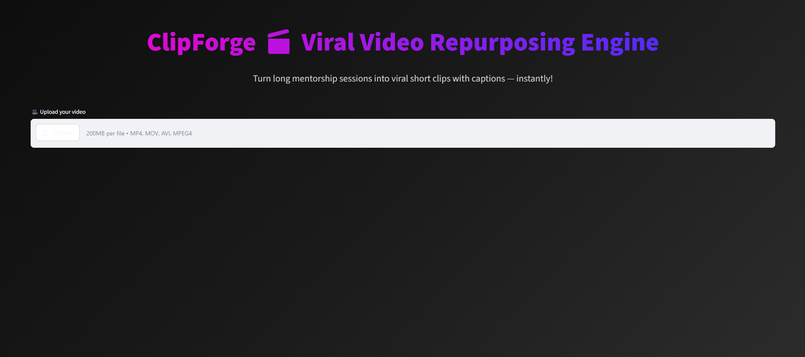

# 🎬 ClipForge — Viral Video Repurposing Engine

> 🚀 Built for **AttentionX Hackathon**  
> Transform long-form videos into **short, viral-ready clips** using AI.

---

## ✨ Overview

**ClipForge** is an AI-powered video repurposing engine that automatically identifies high-impact moments from long videos and converts them into short, engaging clips.

Perfect for:
- 🎥 Content Creators  
- 🎙️ Podcasters  
- 📚 Educators  
- 📱 Social Media Managers  

---

## 🔥 Features

- 🎯 AI detects **viral moments automatically**
- ✂️ Converts long videos into short clips
- 🧠 Smart highlight extraction
- 📥 One-click download for each clip
- ⚡ Fast processing pipeline
- 🎨 Clean & modern UI (Streamlit-based)

---

## 🎬 Demo Video (Mandatory)
> ⚡ Watch how ClipForge turns long videos into viral clips in seconds!

[]

---

## 📸 Screenshots

### 🏠 Home Interface

### 🎬 Generated Viral Clips

---

## ⚙️ How It Works

1. Upload your video 🎥  
2. AI analyzes speech & engagement patterns 🧠  
3. Detects viral-worthy moments 🔥  
4. Generates short clips ✂️  
5. Download instantly ⬇️  

---

## 🖥️ Tech Stack

- **Frontend:** Streamlit  
- **Backend:** FastAPI  
- **Video Processing:** Python (FFmpeg / AI logic)  
- **Styling:** Custom CSS (Glassmorphism UI)

---

## 🛠️ Installation & Setup

    # Clone the repository
    git clone https://github.com/your-username/clipforge.git

    # Navigate into project
    cd clipforge

    # Install dependencies
    pip install -r requirements.txt

    # Run backend server
    uvicorn main:app --reload

    # Run frontend
    streamlit run app.py

---

## 📁 Project Structure

    clipforge/
    │── backend/
    │   ├── main.py
    │   ├── video_processing.py
    │
    │── frontend/
    │   ├── app.py
    │
    │── assets/
    │   ├── screenshots/
    │
    │── requirements.txt
    │── README.md

---

## 🏆 Hackathon

Built with ❤️ for **AttentionX Hackathon**

---

## 💡 Inspiration

In today’s short-form content era, creators spend hours manually editing videos.  
**ClipForge automates this process using AI**, saving time and boosting productivity.

---

## 👨‍💻 Author

**Muskan Kumari**  
💼 Aspiring Developer | Open Source Contributor  

---

## ⭐ Support

If you like this project:
- ⭐ Star the repository  
- 🔗 Share it  
- 💬 Provide feedback  

---